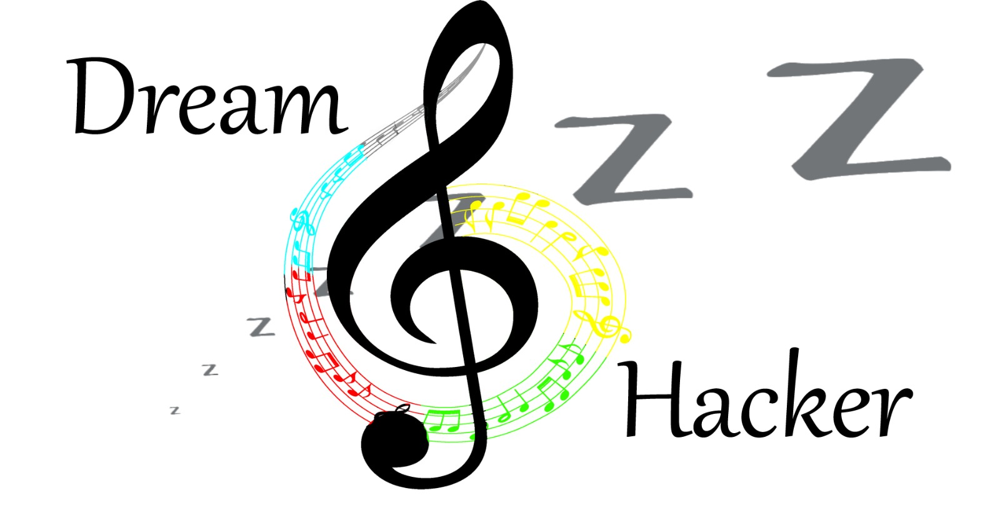

<h2 align="center">DreamHacker</h2> 
<div align="center">
   <a href="https://github.com/praveen1992/DreamHacker/">
    
  </a>
  <p align="center">
    Giving audio stimulus to a sleeping person to manipulate his dreams using raspberry pi. 
    <br />
</div>


This setup takes data from pulse sensor and time of the day etc, to predict when the person has slept.
Then after a while start the audio stimulus.


## Social Media

[YouTube](https://www.youtube.com/channel/UCoZ31rXYGIltQAecAKzutBQ)

[Facebook](https://www.facebook.com/Dream-Hacker-103619898510175)

[Instagram](https://www.instagram.com/proj_dreamhacker/)

<!-- TOC -->
<details open="open">
  <summary><h2 style="display: inline-block">Contents</h2></summary>
  <ol>
    <li>
      <a href="#about">About</a>
      <ul>
        <li><a href="#hardware">Hardware</a></li>
        <li><a href="#software">Software</a></li>
        <li><a href="#roadmap">Roadmap</a></li>
      </ul>
    </li>
    <li>
      <a href="#getting-started">Getting Started</a>
      <ul>
        <li><a href="#prerequisites">Prerequisites</a></li>
        <li><a href="#installation">Installation</a></li>
        <li><a href="#usage">Usage</a></li>
      </ul>
    </li>
    <li><a href="#contributing">Contributing</a></li>
    <li><a href="#license">License</a></li>
    <li><a href="#contact">Contact</a></li>
  </ol>
</details>

<!-- Project descirption -->
## About
DreamHacker is a flexible  tool which allows user to learn their sleep cycle, beats and other biological information about their sleep. It helps in mannipuation their dreams for more comfortable sleep using sound stimulus.

Website interface enables user to select the music they want to play while they are sleeping. They can also see their different information using web Interface. 
The information will include bpm (beats per minute), ecg graph which will be recorded using sensors nad raspberry pi.

<div align="center">

[](https://github.com/praveen1992/DreamHacker/network/contributors)
[](https://github.com/praveen1992/DreamHacker/stargazers)
[](https://github.com/praveen1992/DreamHacker/issues)
[](https://github.com/praveen1992/DreamHacker/blob/master/LICENSE)

<br />

</div>

### Hardware
1. [Raspberry pi ](https://www.raspberrypi.org/products/raspberry-pi-4-model-b/)
1. Pulse Sensor
1. Wires, resistors, etc.

### Software

[Documentation]


### Roadmap


<!-- Getting Started -->
## Getting Started

### Prerequisites
1. Clone the repository

### Installation
Hardware
```
 - Set up the circuit as shown in the diagram.
 - Put a speaker with it's audio jack in the audio output of the raspberry pi.
```

Software
```
1. Use SSH, VNC or a monitor and a keyboard to login to raspberry pi.
2. Clone the repository somewhere in the Raspberry Pi.
3. Run the following commands from inside the repository 
 - `cmake .` 
 - `make`
```

### Usage
- Put your audio files inside the directory Audio/.
- Edit the audio.txt file with the name of the audio you want to play when the sleep starts. For example if you want to play `my_file.mp3` present in the Audio/ directory then write `Audio/my_file.mp3`. Make sure that the file has just one line.
- If you want to run a simulation to test out the setup run the main function with 1 as the argument. `./main 1`. If you want to run the full program just run `./main`

## Contributing

See `CONTRIBUTING` for more information.

<!-- License -->
## License

Distributed under the GPL-3.0 License. See `LICENSE` for more information.


<!-- Contact Info -->
## Contact
</br>


## User Interface
The UI for DreamHacker is a Web application on the localserver. The user will be able to monitor his heart beats per minute and set the audio which he wants to play if the audio is set to play on the server. Such audio can be listned to from a raspberry pi. 

### Software Used 
1. PHP
1. SQL
1. Javascript
1. JQuerry


